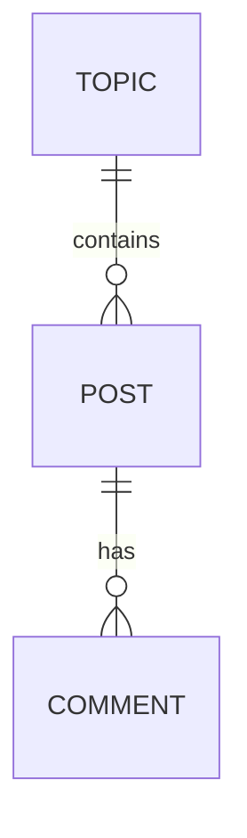

# Entities:

 Topic, Post, Comment

## Relationships:

**1.** A Topic contains zero to many Posts

**2.** A Post contains zero to many Comments

```mermaid
erDiagram
    TOPIC ||--o{ POST : contains 
    POST ||--o{ COMMENT : has
```
