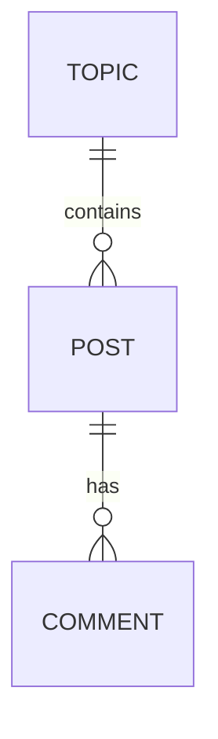

# Mid-submission

## User Stories

### Admin

**US1 Authentication:**
As a forum visitor, I want to enter my username, so that I can contribute to discussions and see my viewing history

### Content (Topic)

**US2 View Topics:** As a forum visitor, I want to have a list of topics, so that I can explore discussions that interest me

**US3 Create Topic:** As a forum user, I want to create topics with a title and desciption, to start a new discussion

**US4 Edit Topic:** As a forum user, I want to edit topic titles and descriptions, to fix mistakes

### Content (Posts)

**US5 View Posts:** As a forum visitor, I want to click on a topic to view all posts, so that I can see posts that interest me

**US6 Create Post:** As a forum user, I want to create a new post, so that I can share my thoughts

**US7 Edit Post:** As a forum user, I want to edit my post, so that I can fix mistakes

**US8 Delete Post:** As a forum user, I want to delete my post, so that I can remove it

### Content (Comments)

**US9 View Comments:** As a forum visitor, I want to click on a post to view all comments, so that I can view the discussion

**US10 Create Comments:** As a forum user, I want to create comments under posts, so that I can contribute to the discussion

**US11 Edit Comments:** As a forum user, I want to edit my comment, so that I can fix mistakes

**US12 Delete Comments:** As a forum user, I want to delete my comment, so that I can remove it

## Design Decisions

### Data Models

**Entities:** Topic, Post, Comment

**Relationships:** 

**1.** A Topic contains zero to many Posts

**2.** A Post contains zero to many Comments

### Libraries

**Front-End:** React.js and Typescript

**Back-end:** Go

**Data-base:** SQLite

**API:** RESTful

### Features

Clear relationship between topic, post and comments within the model.

Simple UI/UX design to make the forum easily navigable.

Requires Authentication in the form of a username to keep track of forum activity.
